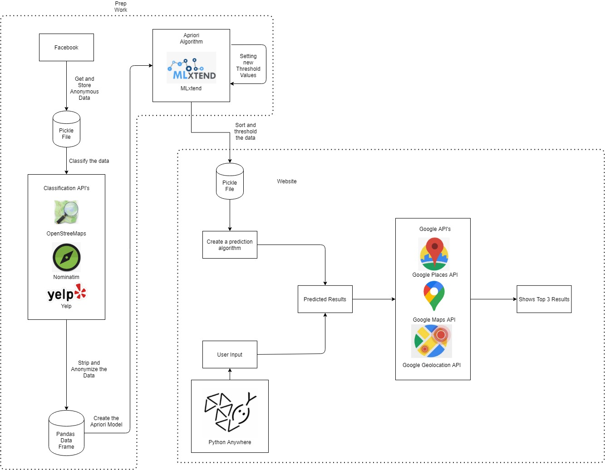
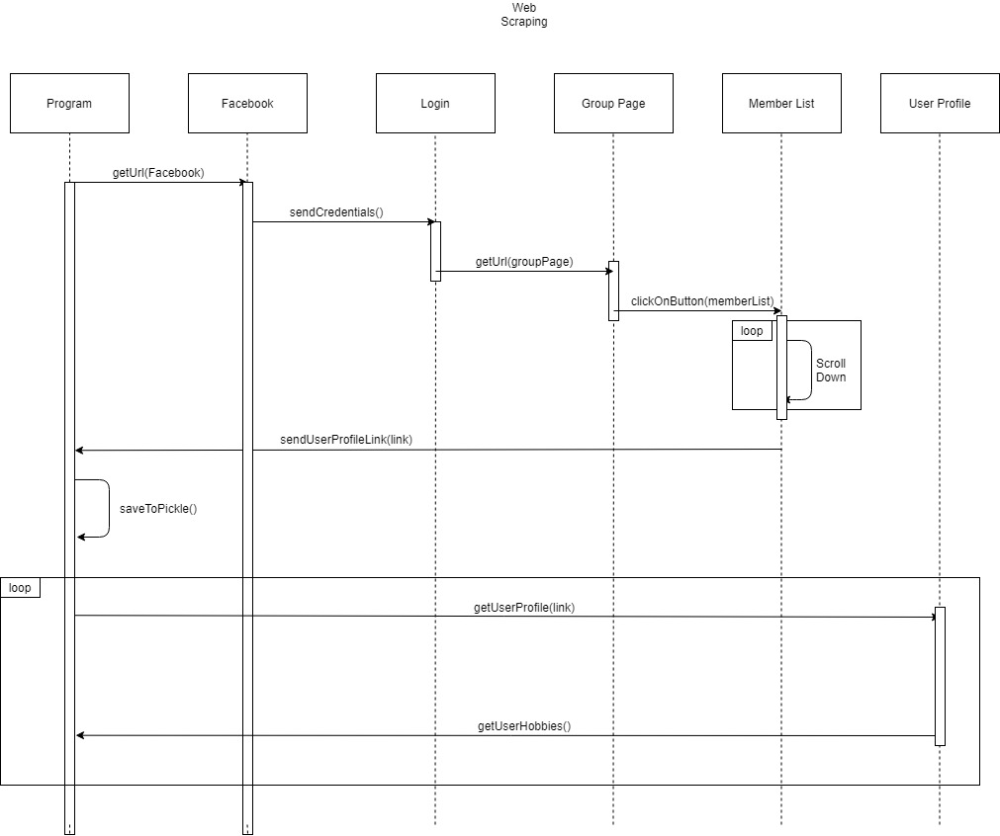
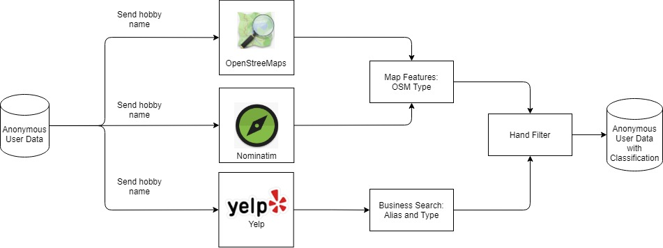
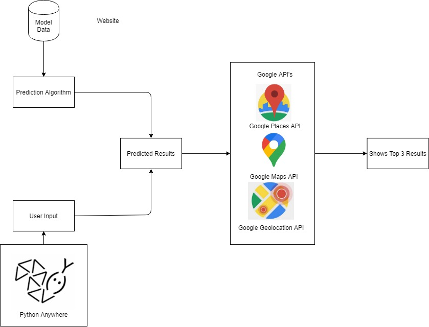

# Capstone

## Abstract
During a pandemic which causes the whole world to fall in a state of lockdown, there may be little opportunity to try new opportunities. Market research companies charge high rates to collect and market products based on your user information. The application I’ve developed is simple to use, requires no user registration, doesn’t collect any information, and is free of charge. Utilizing general information available on social media platforms I’ve implemented a way to predict a customers interest via the Apriori algorithm. By garnering a large and relevant dataset from user profiles, the algorithm predicts user interest based on a statistical model of what previous users are already interested in. The web application I’ve developed encapsulates all these characteristics in a hassle free experience to serve your best interests in mind both privately and generally.

## Dependencies
| Package  | Version |
| --- | --- |
| Selenium | 3.141.0 |
| BeautifulSoup | 4.9.3 |
| Pickle | 1.0.2 |
| Numpy | 1.19.3 |
| mlxtend | 0.18.0 | 
| Pandas | 1.2.3 |
| Geopy | 2.1.0 | 
| Requests | 2.24 |

## My Capstone

#### Web Scraping

Using Selenium and BeautifulSoup, we can automate a script to inject credentials into sites like Facebook and find a collection of users to scrape from.
For my own purposes, I've scraped only the user-id and a users interests before storing it into a Pickle file to be used later for classification. 
This program can be editted to scrape more than just a users interests.

### Classification

Using API's like OSM/Nominatim and Yelp, they handle the classification for us. By sending a hobby name, we can the map feature and see what Yelp classifies it as.
Afterwards we just need to filter it down to what fixes our problem description by deleting unwanted data.

### Apriori Algorithm
The Apriori Algorithm shows the most frequent datasets using support, confidence, and lift. Mlxtend has already implemented this function and stored it using the Pandas dataframe.

### Predicting the Algorithm
We can use the rule set created by Apriori to generate links between hobbies that users might be interested in.

### The Website

A website that shows the model in action by predicting a users next interest depending on what he/she selected. 
It can be found at: https://www.dliu206capstone.com/

### Contact Me
You can contact me at:
dliu206@uw.edu
